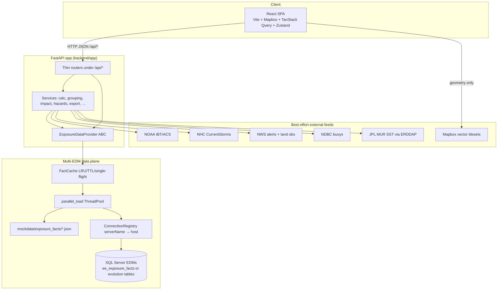
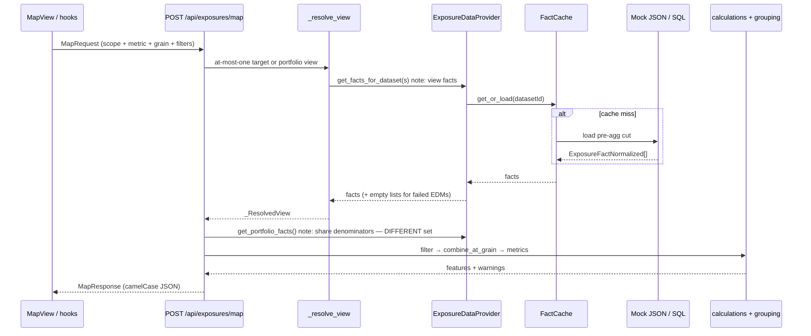
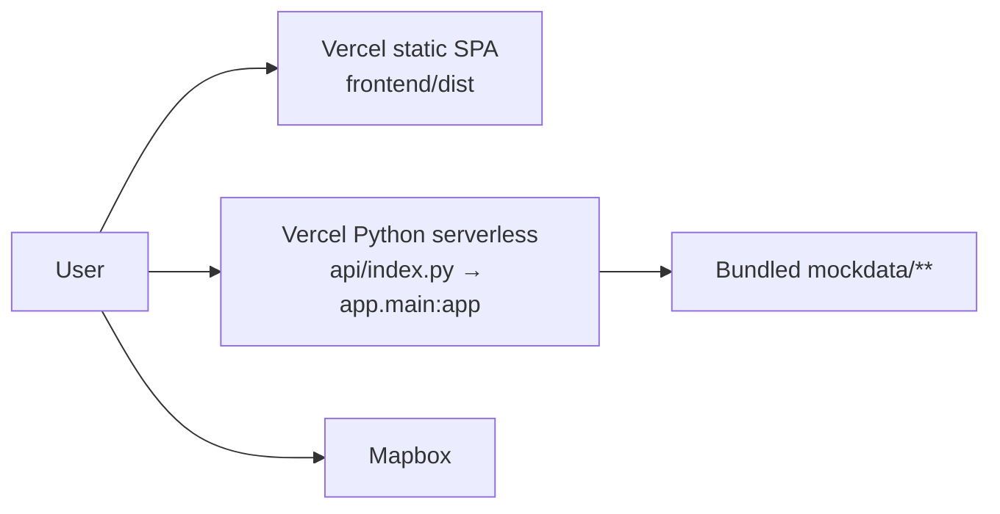
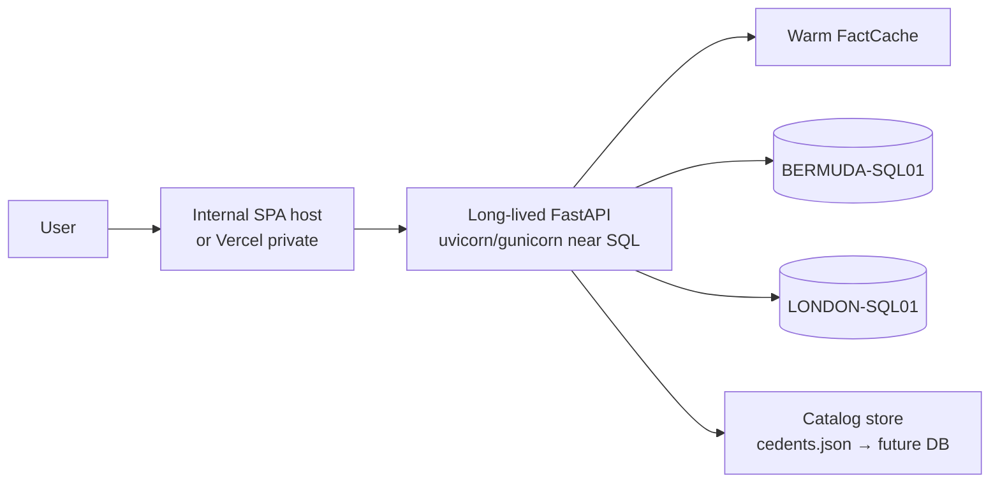

# Peril Vista — System Design Document

| Field | Value |
|---|---|
| **Title** | Peril Vista System Design |
| **Author** | Architecture (synthesized from codebase + docs) |
| **Date** | 2026-07-10 |
| **Status** | Approved (design review) — rev 3 |
| **Decisions locked** | 2026-07-10 (portfolio Option A; fund-analysis quarantine; hybrid fallback demo-only) |
| **Codebase** | `/Users/jamesanfossi/ExposureEclipse` |
| **Audience** | Internal engineers evaluating firm bring-in; implementers; architecture review |
| **Doc type** | As-built system design + multi-EDM intended architecture + productionization path |

---

## Overview

**Peril Vista** is a web-based **Property Catastrophe (Property Cat) exposure management workbench** for reinsurance underwriters. It consumes **pre-aggregated ERT/EDM exposure cuts** and presents them as an interactive Mapbox choropleth, pivot workbench, detail panel, and multi-sheet Excel export — with hurricane impact (NOAA IBTrACS), hazard climatology overlays (tornado / hail / wildfire), live/replay storm context (NHC, NWS, NDBC, SST), and a deterministic excess-of-loss (XOL) layer-calc engine.

**V1 is a mock-data prototype with a real multi-EDM data plane.** The default `MockExposureDataProvider` serves fixtures under `mockdata/`. The same `ExposureDataProvider` ABC is satisfied by `hybrid` and `sqlserver` modes that load pre-aggregated cuts from many SQL Server databases via a multi-host connection registry, process-local fact cache (LRU/TTL/single-flight), and parallel multi-deal load. Auth is intentionally out of scope for the offline demo.

This document is the **system topology + bring-in path** design synthesis for:

1. Evaluating whether to bring this AI-assisted codebase into a reinsurance firm
2. Implementing, extending, or operating the system
3. Architecture / design review sessions

### Document precedence (on conflict)

| Concern | Wins |
|---|---|
| Wire enums, warning codes, money conventions | `docs/CONTRACTS.md` (+ FE/BE mirrors) |
| Entity fields, fact row schema, geography IDs | `docs/DATA_MODEL.md` |
| Formulas for displayed metrics | `docs/CALCULATIONS.md` |
| HTTP shapes | `docs/API.md` |
| Agent / coding hard rules | `CLAUDE.md` |
| **System topology, multi-EDM ops, deploy, security bring-in, PR plan** | **This design document** |

When this design records an **as-built gap** (e.g. portfolio view ≠ portfolio denominator), it is authoritative for *what the code does today*. The **intended fix is locked** (portfolio Option A — in-force only). After PR-00 lands in code, patch `docs/CONTRACTS.md` / `CALCULATIONS.md` so the whole pack agrees. Until then, do not “fix” share metrics using only the portfolio-*mode* rule against as-built denominators.

It aligns with but does not replace the operational docs under `docs/` and `CLAUDE.md`.

---

## Background & Motivation

### Business problem

Underwriters already live in ERT Excel dumps and EDM SQL. Pain points this product targets:

| Pain | Product response |
|---|---|
| Static ERT workbooks | Interactive map + pivot over the same cut shape |
| Multi-deal portfolio views hard to assemble | Cedent → Office → Chain → Programme tree + portfolio mode |
| Peril double-counting traps | Default `MAX_ACROSS_PERILS_AT_VIEW_GRAIN` |
| “Where did this number come from?” | Warnings, currency, dataset traceability on the wire |
| Many EDMs on many SQL hosts | `EDMRef` + connection registry + lazy/parallel fact load |

### What this is / is not

| Is | Is not |
|---|---|
| Front door on **pre-aggregated ERT cuts** | Full RMS / modeling replacement |
| Workbench for map / pivot / export / impact | Greenfield cat model |
| Multi-EDM **read** plane for portfolio views | Location-level EDM analytics engine |
| Demo-ready UX with strong contracts | Production multi-tenant SaaS with SSO out of the box |

### Current state (fixture snapshot, measured 2026-07-10)

| Item | As-built |
|---|---|
| Frontend stack | React 18 + TypeScript + Vite 5 + Mapbox GL JS v3 + TanStack Query v5 + Zustand |
| Backend | Python `requires-python >= 3.12`; FastAPI + Pydantic v2; thin routers; pure calc in services |
| Backend tests | **~107 pytest collected** (`backend/tests/`) |
| Frontend tests | **7** vitest files / **34** `it(...)` cases (when deps installed) |
| Mock catalog | **7** cedents · **8** chains · **14** programmes (10 BOUND, 2 QUOTED, 1 EXPIRED, 1 NTU) |
| Fact files | **19** under `mockdata/exposure_facts/` (~**42,390** rows); **~49 MB** total `mockdata/` |
| Orphan fact files | **7** Farmers single-peril stems **not** linked on the cedent tree (`ds-farmers-{25,26,27}-ws/eq/cs` style) — still pulled into mock `get_portfolio_facts()` |
| Deploy | Vercel SPA + Python serverless for mock demo (`maxDuration: 30`); long-lived host for multi-SQL |

---

## Goals & Non-Goals

### Goals

1. **Document the as-built architecture** with concrete file paths and request paths so new engineers can operate and extend the system without reverse-engineering.
2. **Specify the multi-EDM data plane** — pre-aggregated cuts, cache, parallel load, connection registry, hybrid mode — as the intended production-shaped path for hundreds of EDMs.
3. **Preserve domain correctness** — max-across-perils at view grain, currency never silently mixed, warnings not silent zeros, single calc path for map/pivot/export.
4. **Give a realistic firm bring-in path** — SSO, durable cache/jobs, SQL validation, optional warehouse — as ordered, reviewable PRs, not a rewrite.
5. **Be honest about demo vs production** — auth deferred, process-local cache, in-memory jobs, dual portfolio semantics.

### Non-Goals

1. **Authentication / SSO / RBAC** — intentionally out of scope for the offline demo (must be added before firm user access).
2. **Owning ERT generation or RMS modeling** — this product *consumes* cuts.
3. **Raw location-level EDM choropleths** — scale model assumes pre-aggregated ERT-shaped rows.
4. **Multi-tenant SaaS isolation** — single-tenant / firm-internal assumptions.
5. **Replacing Mapbox with in-app GeoJSON** — geometry stays in Mapbox vector tilesets.
6. **Implementing Databricks provider** — `DATA_PROVIDER=databricks` is a placeholder (`NotImplementedError`).
7. **Full treaty wording / reinstatements / aggregate XOL** — layer calc is deterministic occurrence-style stacks only.
8. **Fund Analysis in pilot** — quarantined behind `ENABLE_FUND_ANALYSIS=false` (PR-04a; locked user 2026-07-10). Not core workbench.

---

## Proposed Design (As-Built Architecture)

### High-level system context



### Layering and hard boundaries

These are load-bearing contracts (see `CLAUDE.md` “10 rules”; county fallback is also load-bearing UX even where comments still say “rule 11”):

| Boundary | Rule | Primary paths |
|---|---|---|
| FE → data | Frontend never opens SQL/files; only `frontend/src/api/*` hits backend | `frontend/src/api/client.ts`, hooks |
| API → math | Routers are thin; formulas live in services once | `backend/app/api/*` → `services/calculations.py`, `grouping.py` |
| Services → storage | Services depend on `ExposureDataProvider`, not concrete sources | `backend/app/providers/base.py` |
| Wire enums | Canonical codes in `docs/CONTRACTS.md`, mirrored FE/BE | `models/enums.py`, `types/contracts.ts` |
| Soft failures | Domain “cannot compute” → `null` + `warnings[]`, not fake zeros | All exposure responses |
| Scope | Single effective selection path on FE | `frontend/src/state/useEffectiveScope.ts` |
| County fallback | Request COUNTY but state lacks county rows → fall back to STATE rows + `WARN_COUNTY_DATA_UNAVAILABLE` | `api/exposures.py` `_county_fallback_if_needed` |
| Export parity | Excel reuses `_resolve_view` + map/detail/pivot builders from the exposures router | `services/export_excel.py` |

### Repository layout (authoritative tree summary)

```
ExposureEclipse/
├── CLAUDE.md                 # Operating manual + 10 hard rules
├── README.md
├── docs/                     # Spec pack (API, contracts, calc, multi-EDM, …)
├── vercel.json               # SPA + /api serverless rewrites; maxDuration 30s
├── api/index.py              # Vercel entry: re-exports app.main:app; CORS env default
├── backend/app/
│   ├── main.py               # FastAPI, CORS, ErrorEnvelope handlers, routers
│   ├── config.py             # Pydantic Settings (DATA_PROVIDER, cache, SQL, …)
│   ├── api/                  # Thin routers (incl. fund_analysis — secondary)
│   ├── models/               # Pydantic v2 domain + wire models
│   ├── providers/            # ABC, mock, sqlserver/hybrid, cache, parallel, registry
│   ├── services/             # Pure(ish) domain services
│   └── ert/                  # Expected ERT table registry
├── backend/tests/            # pytest (~107 collected)
├── frontend/src/
│   ├── api/                  # ONLY place that fetch()es /api
│   ├── components/           # Map, Pivot, Detail, CedentTree, …
│   ├── state/                # Zustand stores + useEffectiveScope
│   ├── types/contracts.ts    # Mirror of docs/CONTRACTS.md
│   └── pages/                # AdminProgrammes, FundAnalysis
└── mockdata/                 # Catalog + facts + hazards + registry template
```

### Request path (exposure map — golden path)



Key implementation: `backend/app/api/exposures.py` (`_resolve_view`, `_facts_for_dataset_ids`, `/map` `/detail` `/pivot`). Selection resolution is shared so map, pivot, and export cannot drift on **view facts**. **Share denominators** deliberately call `provider.get_portfolio_facts()` — a **second, broader portfolio definition** (see [Portfolio definitions](#portfolio-definitions-two-concepts)).

### Frontend architecture

| Concern | Implementation |
|---|---|
| Stack | React 18, TS 5, Vite 5, Mapbox GL JS v3, TanStack Query v5, Zustand, react-resizable-panels v2 |
| Routing | Path-based (no react-router): `/` → `Shell`, `/admin/programmes`, `/fund-analysis` (`frontend/src/App.tsx`) |
| API client | `frontend/src/api/client.ts` — typed `request()`, `ApiError` from ErrorEnvelope |
| Domain hooks | `frontend/src/api/hooks.ts` + resource modules (`exposures.ts`, `cedents.ts`, …) |
| Effective scope | `useEffectiveScope()` — programme / chain / cedent / office `chainIds[]` / scope chips / portfolio |
| User inputs persisted | `damageAssumptions`, `countyOverrides` (localStorage via Zustand persist) |
| Map geometry | Mapbox vector tilesets (state + county); feature-state coloring; auto county at zoom ≥ **4.0** (`COUNTY_THRESHOLD` in `MapView.tsx`) |
| Overlay stacking | Hazard chips hide exposure fill so choropleths don’t fight (`MapView.tsx` gotcha) |

**Frontend rule:** components never import data clients outside `src/api/*`.

### Backend architecture

| Concern | Implementation |
|---|---|
| Entry | `backend/app/main.py` — routers under `/api`, health, global exception → ErrorEnvelope |
| Config | `backend/app/config.py` — `DATA_PROVIDER`, cache knobs, SQL registry paths, CORS, export limits |
| Provider factory | `backend/app/providers/__init__.py` → `get_provider()` process singleton (`lru_cache`) |
| Routers | `admin`, `calc`, `cedents`, `counties`, `dataset_groups`, `ert_jobs`, `exports`, `exposures`, `fund_analysis`, `hazards`, `hurricanes`, `live` |
| Models | Pydantic v2 with camelCase aliases (`CamelModel`) |
| Errors | HTTP errors → `{ error: { code, message, details, traceId, timestamp } }`; domain soft outcomes → 200 + `warnings[]` |

### Provider modes

| `DATA_PROVIDER` | Facts source | Catalog | When |
|---|---|---|---|
| `mock` (default) | `mockdata/exposure_facts/<datasetId>.json` | `cedents.json` | CI, offline demo, Vercel |
| `hybrid` | SQL if `serverName` **registered**; unregistered server → mock file. As-built also falls back to mock on **SQL exception** when `fallback_mock=True` — **firm builds must set `HYBRID_FALLBACK_ON_SQL_ERROR=false`** (locked 2026-07-10) so exceptions do not substitute mock | same | Partial live link-up; demo fallback on, firm fallback **off** |
| `sqlserver` | SQL only (`fallback_mock=False`); failed load raises or returns empty depending on path | same | Strict live env |
| `databricks` | Not implemented | — | Placeholder |

---

## Multi-EDM Data Plane Design

### Core assumption (load-bearing)

Each programme points at one EDM via `EDMRef`. Facts are **pre-aggregated ERT cuts** (country/state/county × peril × dimensions) with the same conceptual shape as `mockdata/exposure_facts/*` — **not** location-level RMS dumps.

Hundreds of programmes ⇒ hundreds of databases, usually on a **small set of SQL hosts**. Portfolio views concatenate pre-agg rows in Python after parallel load; that only works because cuts are warehouse-shaped and already aggregated.

### Per-EDM size envelope (guidance)

| Dimension | Guidance for this architecture |
|---|---|
| Grain | Pre-agg at COUNTRY/STATE/COUNTY (+ dimensions); not location |
| Rows per EDM cut | Mock rich cuts ~**10k rows / ~12 MB** (Farmers BDA multi-peril year); plan for **≤ ~50k rows / EDM** in process cache unless warehouse path |
| Portfolio N | Design target: **hundreds** of pre-agg EDMs with LRU ≥ active set + warmup |
| Reject | Location dumps, multi-million-row tables, or unbounded `SELECT *` without validation |

### Components

| Module | Path | Responsibility |
|---|---|---|
| Fact cache | `providers/fact_cache.py` | Process-wide LRU + optional TTL; single-flight load per `datasetId` |
| Parallel load | `providers/parallel_load.py` | **New** `ThreadPoolExecutor` per `load_many` call; workers from arg (default 16); failed keys → empty list |
| Connection registry | `providers/connection_registry.py` | `serverName` → host/creds/driver; lazy per-(server, database) connections (minimal single-conn holder, not a full pool) |
| SQL row map | `providers/sql_row_map.py` | CamelCase demo columns **or** ERT Evolution columns → `ExposureFactNormalized` |
| SQL / hybrid provider | `providers/sqlserver.py` | Catalog from JSON; facts from SQL or mock fallback |
| Mock provider | `providers/mock.py` | Lazy JSON facts + same cache/parallel APIs |
| Admin ops | `api/admin.py` | `/cache`, `/cache/warmup`, `/connections` |

**Worker config footgun:** concrete providers pass `self._max_workers` from settings into `load_many`. The ABC default `get_facts_for_datasets` in `base.py` **hardcodes `max_workers=16`** and does **not** read settings. Subclasses that only override `get_facts_for_dataset` inherit that hardcode — always override bulk load or keep using mock/sqlserver implementations.

### Load path

```
Selection (programme | chain | chainIds[] | cedent | portfolio view)
    → list of datasetId (one per programme/EDM cut)
    → get_facts_for_datasets (parallel)
    → FactCache.get_or_load per datasetId
    → miss: mock JSON file OR SQL:
         preferred view ee_exposure_facts
         else SQLSERVER_EVOLUTION_TABLE_PATTERN (default {edm}__EVOLUTION)
         cold path today: SELECT * FROM [table]  (full cut into Python)
    → concatenate fact lists
    → filter / combine_at_grain / metric calculators

Separately for share metrics on /map and /detail:
    → provider.get_portfolio_facts()   ← NOT the same inclusion rule as portfolio view
```

### Portfolio definitions (two concepts)

**Critical as-built distinction.** Engineers must not conflate these.

| Concept | Source | Inclusion rule (as-built) | Used for |
|---|---|---|---|
| **Portfolio *view facts*** | `_resolve_view` when no target is set | Every programme with `is_in_force()` — `status == BOUND` and `as_of` in `[inception, expiry]` (missing dates → open-ended) | Map/pivot/export **numerator/view** when user is in portfolio mode |
| **Portfolio *denominators*** | `provider.get_portfolio_facts()` | **Mock:** every programme-linked `datasetId` that has a fact file **plus orphan** stems under `exposure_facts/` that are **not** on the cedent tree — **no** `is_in_force()` filter. **SQL/hybrid:** every programme with `edm.ert_status != ERT_NOT_FOUND` — **no** `is_in_force()` filter | `DEAL_SHARE_OF_PORTFOLIO_IN_GEOGRAPHY`, `GEOGRAPHY_SHARE_OF_TOTAL_PORTFOLIO` (and YoY ratio paths that reuse current portfolio geo TIV) |

Code anchors:

- View: `backend/app/api/exposures.py` `_resolve_view` (empty target branch)
- Denominator: `MockExposureDataProvider.get_portfolio_facts`, `SqlServerExposureDataProvider.get_portfolio_facts`
- Consumers: `/map` and `/detail` call `provider.get_portfolio_facts()` after resolving deal facts

**Fixture footgun:** seven orphan Farmers single-peril files inflate mock denominators beyond the navigation tree.

**Locked firm decision (Key Decision 16 / PR-00) — user 2026-07-10:** **Option A.** `get_portfolio_facts` **must** equal the in-force portfolio view set (`status == BOUND` and date window via `is_in_force()`), **exclude** orphan mock fact stems, and **exclude** QUOTED / EXPIRED / NTU. Emit load-failure warnings (PR-01) if any included dataset fails to load. Dual as-built semantics above are **bugs relative to this decision**, not product options.

### SQL table contract

Per EDM database, loader preference order (`sqlserver.py` `_load_sql`):

1. **`ee_exposure_facts`** — preferred stable view the firm controls  
2. Pattern from `SQLSERVER_EVOLUTION_TABLE_PATTERN` (default `{edm}__EVOLUTION`)

**Cold load cost:** both candidates are read with **`SELECT *`** into Python, then mapped. Prefer projected columns and a thin view; full-table pull dominates cold multi-EDM latency and memory.

#### Minimal `ee_exposure_facts` column checklist

Map via `sql_row_map.py` aliases (case-insensitive). Prefer camelCase names matching `ExposureFactNormalized` to reduce surprise. Required for usable map/calc:

| Logical field | Example columns accepted | Required? |
|---|---|---|
| `geography_id` | `geographyId`, `GeographyId` | **Yes** (or constructible from country/state/county) |
| `geography_level` / `aggregation` | `geographyLevel`, `Aggregation` | **Yes** |
| `peril` | `peril`, `Peril` | **Yes** |
| `tiv` | `tiv`, `TIV` | **Yes** |
| `currency` | `currency`, `Currency` | **Yes** |
| `location_count` | `locationCount`, `#Location` | Strongly recommended |
| `building` / `contents` / `bi` | Building, Contents, BI | Recommended (TIV identity check) |
| `dataset_id` | `datasetId` | Recommended (loader can inject) |
| Dimension bands | occupancy*, construction, distanceToCoast, … | Optional for filters/pivot |
| Source trace | sourceServerName, sourceDatabaseName, sourceTableName | Recommended |

**Grain uniqueness (recommended):** at most one row per  
`(geographyId, peril, occupancySegment?, construction?, … active dimensions present in the cut)`.  
Multi-peril programmes ship **multiple peril rows** per geography (WS/EQ/CS), not summed into one row — max-across-perils happens in `grouping.py`.

Full ERT Evolution ground truth: `docs/ERT_OUTPUT_FORMAT.md`. Full field list: `docs/DATA_MODEL.md`.

### Hybrid load semantics (as-built)

In `SqlServerExposureDataProvider._load_facts` when `fallback_mock=True` (hybrid):

1. If `serverName` **in registry** → try SQL; on **any exception** → log + **mock file fallback**  
2. If `serverName` **not in registry** → mock file  
3. If programme missing → mock file if fallback else `[]`

This can **mask production SQL breakage** as “numbers still look fine” from fixtures. **Locked (user 2026-07-10):** SQL→mock fallback is **demo only**. Firm / pilot builds set `HYBRID_FALLBACK_ON_SQL_ERROR=false` (PR-01); prefer `DATA_PROVIDER=sqlserver` when all hosts are registered.

### Registry file

Template: `mockdata/sql_servers.example.json` → local `mockdata/sql_servers.json` (secrets not committed).

Env knobs (see `backend/app/config.py` / `.env.example`):

| Var | Default | Role |
|---|---|---|
| `FACT_CACHE_MAX_DATASETS` | 256 | LRU size |
| `FACT_CACHE_TTL_SECONDS` | 3600 | `0` = LRU only |
| `FACT_LOAD_MAX_WORKERS` | 16 | Parallel fan-out (concrete providers) |
| `SQLSERVER_SERVERS_FILE` | `../mockdata/sql_servers.json` | Registry path |
| `SQLSERVER_SERVERS_JSON` | — | Inline registry |
| `SQLSERVER_EVOLUTION_TABLE_PATTERN` | `{edm}__EVOLUTION` | Table name pattern |

### Connection / concurrency (as-built limits)

| Behavior | Implication |
|---|---|
| Registry holds **one live connection per (server, database)** with a lock | Not a sized connection pool; concurrent queries on same DB serialize or recreate on error |
| Each `load_many` creates a **new** `ThreadPoolExecutor` | Concurrent portfolio users × N EDMs can stampede SQL hosts |
| Cold SQL load is full `SELECT *` | Memory spike proportional to cut size × concurrent loads |

Hardening: shared executor or semaphore (PR-02b), projected SELECT, pool max size, circuit breaker (see PR Plan).

### Performance expectations

| Situation | Expectation |
|---|---|
| Cold portfolio, N EDMs, mock JSON | Parallel disk parse; dominated by largest files |
| Warm portfolio (cache full) | Near-memory; calc-bound |
| Cold portfolio, N SQL DBs | Network + SQL; workers cap concurrent opens **per request** |
| Vercel serverless | Cache empty every cold start — **not** suited for multi-SQL; `maxDuration: 30` can kill cold IBTrACS/live paths |

**Rough capacity target:** hundreds of *pre-aggregated* EDMs with `FACT_CACHE_MAX_DATASETS` ≥ active set and warmup before demos. Raw location extracts will not fit this path.

### Failure isolation (as-built + intended wire)

**As-built:** `parallel_load.load_many(..., on_error="empty")` → failed keys become `[]`; `_facts_for_dataset_ids` concatenates empties; portfolio still returns **200**. Cache stats expose aggregate `load_errors` only — **not** which `datasetId`s failed on the response.

**Distinctions implementers must keep:**

| Case | As-built behavior | Intended (PR-01) |
|---|---|---|
| SQL/file load exception | Empty list for that dataset; portfolio continues | `WARN_EDM_LOAD_FAILED` with `details.errors[]` / `datasetIds` |
| Load succeeds, 0 rows in cut | Empty list, no error | Optional `WARN_EDM_EMPTY_CUT` |
| Load succeeds, filters match 0 rows | Empty features + `WARN_FILTERS_RETURN_NO_ROWS` | unchanged |
| Hybrid SQL error → mock success | Mock numbers, exception only in logs | **Firm:** disabled (`HYBRID_FALLBACK_ON_SQL_ERROR=false`); treat as load failure + warning. **Demo:** may remain on with metric `HYBRID_SQL_FALLBACK_COUNT` |

**Mode policy:**

| Provider | Fail-open (empty) | Fail-closed / fallback |
|---|---|---|
| `mock` | Default | N/A |
| `hybrid` (demo) | Empty on total failure | SQL→mock fallback **allowed** (`HYBRID_FALLBACK_ON_SQL_ERROR=true`) |
| `hybrid` (firm) | Empty + `WARN_EDM_LOAD_FAILED` | **SQL→mock fallback off** (locked 2026-07-10) |
| `sqlserver` (strict) | Portfolio may still empty-fill today | **Intended:** optional `FACT_LOAD_ON_ERROR=raise` for single-deal; portfolio still partial + warnings |

### Admin / ops surface

| Endpoint | Purpose |
|---|---|
| `GET /api/admin/cache` | Cache stats |
| `POST /api/admin/cache/warmup` | Preload (`inForceOnly` or explicit `datasetIds`) |
| `DELETE /api/admin/cache` | Flush all or `?datasetId=` |
| `GET /api/admin/connections` | Registered hosts; `?probe=true` → live `SELECT 1` |
| `GET /api/health` | Liveness + provider mode + cache summary |

---

## Domain Model & Calculation Principles

### Navigation hierarchy

```
Cedent (insurer, region bucket)
 └── Office (BDA / NYC / LON)     ← display tier only → resolves to chainIds[]
      └── ProgrammeChain          ← renewal lineage; unit of YoY
           └── Programme (year)   ← multi-peril; status BOUND/QUOTED/…
                ├── EDMRef        ← serverName + edmDatabaseName + currency + ertStatus
                └── datasetId     ← FactCache key / mock filename
```

Models: `backend/app/models/cedent.py` (`Cedent`, `ProgrammeChain`, `Programme`, `EDMRef`).

### Analytical row: `ExposureFactNormalized`

All map/detail/pivot/export math runs on this shape (`docs/DATA_MODEL.md`, `models/exposure.py`):

- Geography: `geographyId` (`US`, `US-FL`, `US-FL-12086`, CRESTA…), level, names
- Peril, occupancy dimensions, construction/coast/stories/year bands
- Money: `building`, `contents`, `bi`, `tiv` (= sum of components), `explimGross` / `explimNet`
- Counts, currency, source server/database/table for traceability

### Selection model (at most one target)

`POST /api/exposures/{map,detail,pivot}` accepts **at most one** of:

| Target | Meaning |
|---|---|
| `programmeId` | Single programme/year |
| `chainId` | Latest programme; prior auto-paired (override via `comparisonProgrammeId`) |
| `chainIds[]` | Office multi-chain or scope-filter chip resolution |
| `cedentId` | All chains under cedent |
| `datasetId` / `datasetGroupId` | Legacy escape hatches |
| **none** | **Portfolio *view* mode**: all currently in-force BOUND programmes (`is_in_force()`) |

Frontend resolves scope once in `useEffectiveScope()` so map, pivot, export, and hurricane impact agree on **selection**. Share metrics still use `get_portfolio_facts()` until PR-00.

### Max-across-perils (default combination)

**Default group combination:** `MAX_ACROSS_PERILS_AT_VIEW_GRAIN`.

```
For each group key g (= every active view dimension):
  combinedTIV(g) = MAX over distinct perils p of TIV(facts_p, g)
```

- Viewing State → max per state  
- Viewing County + Occupancy → max per (county, occupancy)  
- **Never sum** across distinct perils unless `SUM_DISTINCT_SEGMENTS` with explicit confirmation  
- Location count under max: count from the EDM that supplied the max TIV for that key  

Implementation: `backend/app/services/grouping.py`. Tests: `backend/tests/test_grouping.py`.

### Core metrics (single source of truth)

| Metric | Formula sketch | Denominator source (as-built) |
|---|---|---|
| TIV | Σ `fact.tiv` at grain | View facts only |
| LOCATION_COUNT | Σ `location_count` | View facts only |
| DEAL_SHARE_OF_PORTFOLIO_IN_GEOGRAPHY | deal geo TIV ÷ portfolio geo TIV | **`get_portfolio_facts()`** (broader) |
| GEOGRAPHY_SHARE_OF_TOTAL_PORTFOLIO | portfolio geo ÷ total portfolio | **`get_portfolio_facts()`** |
| SELECTED_DEAL_GEOGRAPHY_CONCENTRATION | deal geo ÷ deal total | View (deal) facts |
| CLIENT_MARKET_SHARE | client TIV ÷ RMS IED | IED CSV, not portfolio |
| YoY (`yoyMode`) | (current − prior) / prior | Prior deal facts; **ratio YoY still uses current portfolio geo from `get_portfolio_facts()`** (v1 approx) |

Implementation: `backend/app/services/calculations.py`. Documented in `docs/CALCULATIONS.md` (does not yet fully document the dual portfolio sets — see precedence).

### Universal calc principles

1. One source of truth — map, detail, pivot, Excel call the same functions  
2. No silent currency mixing — mismatch → warn/block; currency rides every money value  
3. `null` not `0` for “cannot compute,” paired with a warning code  
4. Divide-by-zero never raises — return `None` + warning  
5. Aggregate, then divide for ratios  
6. Excel export accuracy > formatting — export reuses the same builders as the screen  
7. County grain degrades with warning rather than empty map when county rows missing  

### Hurricane impact

- Source: NOAA IBTrACS v04r01 NA-basin CSV (live-fetched, `lru_cache`)  
- Wind field: Rmax (USA_RMW or Willoughby fallback); asymmetric R64 per-quadrant with bearing interpolation  
- Filters: wind ≥ 64 kt, status `HU`, US bbox; county capture uses R64 at bearing to centroid and min impact wind  
- Response: footprint, cones, per-county TIV + `byProgramme[]`  
- **Loss bands are FE-owned:** `damageAssumptions` + `countyOverrides` in browser; not sent to backend  

Service: `backend/app/services/hurricane_impact.py`, `ibtracs.py`.

### Layer calc (API ready; UI pending)

`POST /api/calc/layers` → `services/layer_calc.py`:

```
ground_up = TIV × damage_ratio
loss_to_layer = max(0, min(gross − deductible, limit))
ceded = loss_to_layer × share
```

Stacked layers evaluate independently against the same gross loss. Reinstatements / aggregate limits / event-vs-occurrence wording out of scope for v1.

### Hazard overlays

Pre-baked grids `mockdata/hazard_{tornado,hail,wildfire}_grid.json` from offline scripts (`backend/scripts/build_*_grid.py`). Tornado/hail: 60% climatology prior + 40% SPC history KDE (avoids population-reporting bias). Wildfire: acres-weighted WFIGS KDE; UI chip currently hidden in `HazardOverlayControls.tsx` (backend grid live).

---

## API Surface & FE/BE Contracts

### Wire conventions

| Rule | Detail |
|---|---|
| Enums | `UPPER_SNAKE_CASE` string codes from `docs/CONTRACTS.md` |
| JSON fields | `camelCase` |
| Money | Dataset currency; no implicit FX; always carry `currency` |
| Ratios | Decimals in `[0,1]` |
| Missing metrics | `null` + warning, never silent zero |
| Errors | ErrorEnvelope with `code`, `message`, `details`, `traceId`, `timestamp` |

Cross-check: `backend/app/models/enums.py` · `frontend/src/types/contracts.ts` · `frontend/src/tests/contracts.test.ts`.

### Endpoint inventory (summary)

| Area | Methods / paths |
|---|---|
| Meta | `GET /api/health`, OpenAPI `/api/docs` |
| Cedents | `GET /api/cedents`, `/cedents/{id}`, `/chains/{id}`, `/programmes/{id}`, `/programmes/{id}/status` |
| Exposures | `POST /api/exposures/map`, `/detail`, `/pivot` |
| Export | `POST /api/exports/excel` (stream `.xlsx`) |
| Dataset groups | legacy in-memory CRUD |
| ERT jobs | `POST /api/ert-jobs/run`, status, cancel (in-process mock) |
| Hurricanes | `GET /api/hurricanes`, `POST .../impact`, `.../impact/export` |
| Live storms | `GET /api/live/storms`, `/storms/{atcfId}` |
| Hazards | `GET /api/hazards/{tornado\|hail\|wildfire}` |
| Counties | `GET /api/counties/{geographyId}/reference` |
| Calc | `POST /api/calc/layers` |
| Admin | programmes treaty metadata, EDM links, cache, connections |
| Fund analysis | `/api/fund-analysis/*` optimizer endpoints — **secondary**, **untested** in `backend/tests/`, **unauthenticated** |

Full shapes: `docs/API.md`.

### Warning & error codes (selected)

Warnings (200 + payload): `WARN_COUNTY_DATA_UNAVAILABLE`, `WARN_CURRENCY_MISMATCH`, `WARN_IED_DENOMINATOR_MISSING`, `WARN_DATASET_GROUP_MAX_ACROSS_PERILS`, `WARN_ERT_TABLES_PARTIAL`, `WARN_FILTERS_RETURN_NO_ROWS`, …

**Proposed (PR-00 / PR-01):** `WARN_EDM_LOAD_FAILED`, `WARN_EDM_EMPTY_CUT`, `WARN_PORTFOLIO_DENOMINATOR_BROADER_THAN_VIEW`, hybrid SQL→mock diagnostic codes.

Hard errors: `VALIDATION_ERROR` 422, `DATASET_NOT_FOUND` 404, `CURRENCY_MISMATCH` 409, `EXPORT_TOO_LARGE` 413, `INTERNAL_ERROR` 500, …

### FE ↔ BE contract tests

- Backend: API tests for exposures, exports, jobs, live, multi-EDM — **not** fund_analysis  
- Frontend: contracts enum parity + client error handling + store/UI unit tests  

---

## Deployment Topologies

### Topology A — Mock product demo (current Vercel)



| Property | Value |
|---|---|
| Config | `DATA_PROVIDER=mock`, `VITE_MAPBOX_TOKEN` at **build** time |
| Cache / jobs | Process-local — empty on cold start; ERT job poll may miss across instances |
| Function limit | `vercel.json` **`maxDuration: 30`** — cold IBTrACS parse (~2–3s) usually OK; heavy live+SST bundles can approach the cap |
| SQL | Do **not** put production EDM passwords here |
| Fit | Stakeholder demo, AI-usage showcase, CI-like smoke |

Files: `vercel.json`, `api/index.py`, `api/requirements.txt` (lean: fastapi, pydantic, openpyxl — no pyodbc).

### Topology B — Internal multi-EDM (recommended for firm pilot)



| Property | Value |
|---|---|
| Config | `DATA_PROVIDER=hybrid` with **`HYBRID_FALLBACK_ON_SQL_ERROR=false`** (locked), or `sqlserver` after validation; VPN break-glass for engineering without SSO |
| Ops | `POST /api/admin/cache/warmup` after deploy / ERT refresh |
| CORS | Explicit SPA origin list (not `*.vercel.app` glob — see Security) |
| Auth precondition | **SSO before any non-demo user.** Hybrid **without** SSO is only acceptable on **network-isolated** break-glass hosts with no external users |
| Fit | 10–50 → hundreds of pre-agg EDMs with warm cache |

**Pilot default topology:** one long-lived API near SQL with parallel fan-out (not per-region shards) — see Alternatives §5.

### Topology C — Optional future warehouse path

Pre-agg facts landed in a firm warehouse with one fact table keyed by `datasetId` / programme. Provider becomes a single SQL source with partition pruning. **Not built** — normalized fact shape already warehouse-compatible.

### Local development

```bash
# Backend
cd backend && pip install -e ".[dev]" && uvicorn app.main:app --reload --port 8000
# Frontend
cd frontend && npm install && npm run dev   # :5173 proxies /api → :8000
```

---

## Security & Privacy Considerations

### Current posture (demo)

| Topic | Stance |
|---|---|
| AuthN / AuthZ | **None** — any client that can reach `/api` can read catalog, facts, exports, admin cache flush, **fund-analysis optimize**, **layer calc** |
| Secrets | Env + local `sql_servers.json`; passwords live in **process memory** via registry; do not commit passwords; **no log redaction** of connection strings today |
| PII | Aggregates by geography — still **commercially sensitive** (TIV by county/deal) |
| Network | Firm SQL is internal; hybrid needs VPN / on-prem placement |
| Logging | Basic Python logging; no audit trail of who exported what |
| CORS | `config` defaults to localhost; `api/index.py` also sets `https://*.vercel.app` — **Starlette does not treat `*` as a true browser wildcard** for CORS origin matching; preview deploys may fail CORS or require exact origin listing |
| Admin surface | Cache invalidate / connection probe / treaty CSV import unprotected |
| Write freeze | Treaty linkage / admin import mutates JSON on disk today — **freeze external writes until auth (PR-04/05)** |

### Explicit non-goals (v1 demo)

- SSO (OIDC / SAML / Azure AD)  
- Deal-level entitlements / row-level security  
- Encryption at rest beyond host defaults  
- Full audit log of exports and admin mutations  

### Pilot entitlement default (interim)

Until PR-15: **all authenticated pilot users see the full entitled firm catalog / all-bound portfolio** (no deal-level RLS). Requires **legal/compliance sign-off** that commercial sensitivity is acceptable within the pilot group. Do not expand audience beyond that group without PR-15.

### Threat model (abbreviated)

| Threat | Severity | Mitigation (current / recommended) |
|---|---|---|
| Unauthenticated data exfil via Excel export | **High** without SSO | SSO + network isolation before pilot users |
| Unauthenticated **CPU/DoS** via portfolio map (parallel SQL fan-out) or fund-analysis optimize | **High** | Auth, rate limits, disable fund-analysis in pilot (PR-04a), semaphore on EDM loads |
| Unauthenticated layer-calc / admin cache flush | **High** / Medium | Gate `/api/admin/*`, `/api/calc/*`, `/api/fund-analysis/*`, exports behind auth + role |
| SQL creds on Vercel | **High** | `DATA_PROVIDER=mock` on public Vercel only |
| Secrets in process memory / logs | Medium | Vault injection (PR-10); never log ODBC strings; redaction middleware |
| Hybrid SQL→mock masking outages | Medium | Metrics + disable fallback in prod |
| CORS misconfig (`*.vercel.app`) | Medium | Explicit origin allowlist per environment |
| SSRF via external weather URLs | Low–Med | Fixed allowlisted endpoints today |
| Dependency supply chain | Medium | Pin lockfiles; optional `pyodbc` |
| Currency / metric manipulation | Low | No write path to facts; calc server-side |

### Recommendation for firm bring-in

Host API on internal runtime near SQL; SPA internal or private; **SSO before any non-demo user**; never place production EDM credentials on public serverless. Hybrid without SSO only on **VPN/break-glass** with no external users.

---

## Observability

### What exists today

| Signal | Where |
|---|---|
| Liveness | `GET /api/health` (+ provider, cache summary, registered server count) |
| Cache stats | `GET /api/admin/cache` — hits, misses, rows, load_errors |
| Connection probe | `GET /api/admin/connections?probe=true` |
| App logs | stdlib `logging` (e.g. failed fact loads in `parallel_load`) |
| Trace id | Generated on **error** envelopes only (not full request correlation) |

### Gaps for production

| Gap | Recommendation |
|---|---|
| No structured request logs | JSON access logs with `traceId`, scope keys, dataset count, latency |
| No metrics backend | Prometheus/OTel: request latency, cache hit rate, SQL load latency p95, worker concurrency, export size, hybrid fallback count |
| No alert on load_errors | Alert if portfolio returns many empty EDMs or `load_errors` rises |
| No export audit | Log principal, scope, row count, hash of filter body |
| No APM | OpenTelemetry on FastAPI + pyodbc |
| Serverless cold-start blind spot | Prefer long-lived host metrics for multi-EDM |
| External feed failures | Degraded flags on live/hurricane responses + metrics |
| No measured baseline | Capture p50/p95 before treating SLOs as commitments (PR-00c) |

### Suggested SLOs (pilot) — **targets pending baseline**

These are **aspirational**, not measured in-repo. Record baselines on the intended host class before pilot commit (Farmers BDA STATE map + portfolio warmup N=in-force).

| Surface | Target (warm cache, internal host) | Status |
|---|---|---|
| Single programme map STATE | p95 < 300 ms | Pending baseline |
| Portfolio map N≈50 EDMs cold | p95 < 15 s first load; < 1 s warm | Pending baseline |
| Excel export ≤ 50k rows | p95 < 30 s | Pending baseline |
| Health | 99.9% (internal) | Pending baseline |

---

## Risks, Scale Limits & Constraints

| Risk | Severity | Mitigation |
|---|---|---|
| **Portfolio view ≠ portfolio denominator** (share bias, orphan mocks) | **Critical** numerical (as-built) | **PR-00 Option A locked** — align + tests; dual semantics are bugs until fixed |
| Process-local FactCache empty on serverless / multi-instance | High for SQL | Long-lived host; shared cache PR |
| Failed EDM → empty list (portfolio understates silently) | High | PR-01 warnings with `datasetIds`; optional hard-fail |
| Hybrid SQL→mock masks outages | High for prod hybrid | **Locked:** `HYBRID_FALLBACK_ON_SQL_ERROR=false` in firm builds; metrics in demo |
| Pre-agg assumption violated (location tables / huge SELECT *) | High | PR-01 validation ceilings |
| Concurrent `load_many` pool stampede | High under multi-user | Shared semaphore / pool (PR-02b) |
| Unauthenticated compute + export | Critical before firm users | SSO; **fund-analysis quarantined (PR-04a locked)** |
| Memory: hundreds of large cuts in LRU | Medium | Tune LRU; Redis with care (serialization cost) |
| In-memory ERT jobs / dataset groups | Medium | Durable store (PR-03); deliberate v1 demo choice (KD-18) |
| YoY ratio metrics use current portfolio denominator | Medium | Documented; PR-13 |
| External NOAA/NWS/NDBC/SST + Vercel 30s | Medium | Offline degrade; long-lived host for live demos |
| Mapbox tileset IDs hardcoded (`bermuda1023.*`) | Medium | PR-14 day-one for firm demo |
| AI-assisted codebase review risk | Medium | Contracts + tests + review protocol |

### Scale envelope

| Workload | Fit |
|---|---|
| ~19 mock EDMs / demo | Excellent |
| 10–50 pre-agg EDMs, warm cache | Good on long-lived API |
| Hundreds of pre-agg EDMs, warmup + LRU ≥ active set | Designed for this |
| Thousands of EDMs or raw locations | **Out of envelope** — warehouse or push-down aggregation |

---

## Alternatives Considered

### 1. Live fan-out multi-EDM (current hybrid) — **selected for pilot**

**Approach:** Per-request (or cached) parallel load of pre-agg cuts from each EDM DB; calc in Python.

| Pros | Cons |
|---|---|
| Matches existing ERT-per-EDM ownership | Cache process-local |
| No central warehouse required to pilot | Cold portfolio cost scales with N |
| Hybrid mode eases partial link-up | Failure isolation + hybrid fallback footguns |
| Same code path as mock | Not for raw locations |

### 2. Central analytical warehouse

**Approach:** ETL all ERT cuts into one fact table; single SQL query with `WHERE dataset_id IN (…)`.

| Pros | Cons |
|---|---|
| Better firm-wide scale | ETL ownership, freshness lag |
| Shared durable cache | Pipeline rebuild |
| Easier RBAC at query layer | Overkill for small pilot |

**When later:** hundreds–thousands of EDMs, multi-instance API. Fact schema already warehouse-shaped.

### 3. Push-down aggregation per SQL host (partial warehouse)

**Approach:** Keep multi-host topology but push max-across-perils / geo aggregate into SQL views per EDM or per host, returning only grain rows needed for the request.

| Pros | Cons |
|---|---|
| Less Python memory | View maintenance per EDM |
| Faster cold path than full cut pull | Harder to keep max-across-perils consistent |

**Status:** Not built; compatible evolution of `_load_sql` if cuts stay too large.

### 4. Frontend-direct SQL / embedded analytics — **rejected**

Breaks provider boundary and hard rules; secrets + calc drift risk.

### 5. Full location-level engine in-app — **rejected**

Out of product scope; portfolio infeasible in-process.

### 6. Deployment sharding (per-region / per-`serverName` API pods) vs single API

| Option | Pros | Cons |
|---|---|---|
| **Single long-lived API + parallel fan-out (pilot default)** | Simple ops; one cache to warm; matches current code | Cross-region SQL latency; stampede risk under multi-user |
| Per-office or per-serverName pods | Data locality; blast isolation | Split portfolio views need fan-out of APIs; harder auth/cache consistency |

**Pilot selection:** single API near the majority of SQL hosts. Revisit sharding only if cross-region RTT or host isolation requirements force it.

### 7. Auth patterns

| Option | Pros | Cons | When |
|---|---|---|---|
| **SPA public client + API JWT validation (OIDC)** | Fits SPA; standard Azure AD / Okta | Token storage XSS care; CORS must be tight | **Default for pilot** |
| Session BFF (cookie to BFF, BFF holds tokens) | HttpOnly cookies; hides tokens | Extra hop; more infra | If firm forbids SPA tokens |
| Network-only (VPN, no app auth) | Fast break-glass | No user audit; compliance weak | **Demo / break-glass only** |

### 8. Durable cache backends

| Option | Pros | Cons | When |
|---|---|---|---|
| Process-local LRU (as-built) | Zero infra; single-flight easy | Multi-instance cold | Demo + single replica |
| **Redis** (shared) | Multi-replica warm | Serializing tens of thousands of Pydantic rows/EDM may be **too large/slow**; need compact codec (msgpack/parquet) + TTL; cross-instance single-flight incomplete | Multi-replica pilot |
| Shared filesystem / local disk cache | Simple; large payloads OK | Sticky filesystems; weak multi-node | Single host large cuts |
| Warehouse as cache | Query push-down | ETL lag | Scale-out phase |

**Selection criteria:** measure serialized cut size before committing Redis; if median EDM > ~5–10 MB compressed, prefer disk cache or warehouse over naive JSON-in-Redis.

### 9. Catalog source of truth

| Option | Pros | Cons |
|---|---|---|
| `cedents.json` + admin JSON (as-built) | Simple demo | Concurrent write unsafe; no audit |
| Firm deal system / DB | SoT alignment | Integration cost |

---

## Recommended Productionization Path (Firm Bring-In)

Aligned with `docs/FOR_INTERNAL_DEVELOPERS.md` decision matrix:

| Goal | Recommendation |
|---|---|
| Stakeholder / AI showcase | Ship as-is (mock) |
| Internal pilot 10–50 EDMs | Data trust (portfolio + load warnings) → Mapbox/env → SSO → secrets/obs → hybrid/SQL on isolated host → durability |
| Firm-wide hundreds of EDMs | Durable cache, optional warehouse, entitlements |
| Replace RMS/ERT generation | Out of scope |

### Phased path


**Phase precondition note:** P3 (hybrid/SQL with real EDMs) **before** full SSO is only allowed if the API is **network-isolated** (VPN/private), **no external users**, and treated as break-glass engineering access. **SSO (P1) is required before any non-demo underwriter user.** The earlier diagram that put hybrid before SSO is revised to put **SSO before non-demo users**; engineering SQL validation may proceed on isolated hosts in parallel with P1 once P0 is done.

### Ownership boundaries

| Team | Owns |
|---|---|
| Underwriting / exposure ops | Programme tree, which EDMs, treaty linkage |
| Data / SQL platform | ERT cuts / `ee_exposure_facts`, server registry |
| App engineering | FastAPI + React, calc correctness, deploy |
| Security | Auth, secrets, network path to SQL |
| Compliance | Pilot entitlement “all users see all deals” sign-off |

---

## Open Questions

### Resolved (user 2026-07-10)

4. **Portfolio denominator rule** — **Resolved — user 2026-07-10: Option A.** In-force only (align with portfolio view; exclude orphan mock files). Implemented by PR-00. See Key Decision 16.
8. **Fund analysis** — **Resolved — user 2026-07-10: Quarantine / feature-flag off for pilot (PR-04a).** Not core workbench. See Key Decision 19.
11. **SQL→mock fallback in hybrid** — **Resolved — user 2026-07-10: Demo only; disable in firm builds** via `HYBRID_FALLBACK_ON_SQL_ERROR=false`. See Key Decision 20 / PR-01.

### Still open

1. **Catalog source of truth** — stay on `cedents.json` + treaty admin, or firm deal system / database?  
2. **SSO provider** — Azure AD / Okta / firm standard OIDC? SPA JWT vs BFF session?  
3. **Entitlements long-term** — by office, underwriter, cedent, or all-bound portfolio?  
5. **Prior portfolio for YoY ratios** — when/whether to load prior-year portfolio denominators.  
6. **Warehouse timeline** — only after pilot metrics, or parallel workstream?  
7. **Mapbox tilesets** — firm-owned tileset IDs vs current `bermuda1023.*` demo tilesets.  
9. **Currency conversion** — firm FX service vs manual `currencyAssumption` only.  
10. **ERT job real integration** — keep mock lifecycle or hook firm batch scheduler?

---

## Key Decisions

| # | Decision | Rationale |
|---|---|---|
| 1 | **Provider ABC as the only data seam** (`ExposureDataProvider`) | UI and calc stay independent of mock vs SQL. |
| 2 | **Pre-aggregated ERT cuts, not location-level rows** | Portfolio multi-EDM load only tractable on warehouse-shaped facts. |
| 3 | **Default `MAX_ACROSS_PERILS_AT_VIEW_GRAIN`** | Summing multi-peril EDMs double-counts TIV. |
| 4 | **Soft failures: warnings + null, never silent zeros** | Trust requires visible missing data. |
| 5 | **Single calc path for map, detail, pivot, export** | Excel accuracy; no surface formula drift. |
| 6 | **Single effective scope on the frontend** (`useEffectiveScope`) | Prevents map/pivot/export selection drift. |
| 7 | **Process-local FactCache + parallel load for multi-EDM** | Low infrastructure for pilot; trade-off vs multi-instance. |
| 8 | **`hybrid` provider for partial live link-up (demo)** | Subset of hosts live; remainder mock. **Not** silent production default. |
| 9 | **Prefer `ee_exposure_facts` view over ad-hoc evolution tables** | Stable firm-controlled contract. |
| 10 | **Auth deferred for offline demo** | Unblocks demos; must not be mistaken for production readiness. |
| 11 | **Mapbox vector tilesets for geometry** | Metric payloads only; auto state/county by zoom ≥ 4. |
| 12 | **Hurricane loss assumptions stay client-side (v1)** | Underwriter owns damage model until server presets. |
| 13 | **Vercel for mock SPA; long-lived host for multi-SQL** | Serverless cold cache + 30s limit wrong for multi-EDM SQL. |
| 14 | **Canonical enums in `docs/CONTRACTS.md` with FE/BE mirrors** | Wire stability under AI-assisted development. |
| 15 | **Catalog navigation: Cedent → Office → Chain → Programme → EDMRef** | Matches renewal lineage and YoY unit. |
| 16 | **Portfolio denominator = Option A (in-force only)** — same set as portfolio view; exclude orphans and non-in-force programmes. **Locked user 2026-07-10.** | As-built dual semantics bias share metrics and include orphan mock files; PR-00 implements alignment. |
| 17 | **Multi-EDM fail-open with empty lists is deliberate v1; production surfaces per-dataset failures** | Keeps portfolio usable under partial outage; silent understatement is unacceptable without warnings. |
| 18 | **In-memory ERT jobs + in-memory dataset groups are deliberate demo-only state** | Acceptable on single-process mock; not multi-instance. |
| 19 | **Fund Analysis quarantined for pilot** (`ENABLE_FUND_ANALYSIS=false` / PR-04a). **Locked user 2026-07-10.** | Secondary experimental surface; large untested API/UI; not core workbench. |
| 20 | **Hybrid SQL→mock fallback is demo-only; firm builds set `HYBRID_FALLBACK_ON_SQL_ERROR=false`.** **Locked user 2026-07-10.** | Masking SQL failures as mock success is a production footgun. |
| 21 | **Pilot entitlement default: all pilot users see full catalog until PR-15** | Explicit interim; requires compliance sign-off. |
| 22 | **Pilot auth pattern: SPA OIDC JWT → API validation** (unless firm mandates BFF) | Fits existing SPA; BFF is valid alternative. |

---

## PR Plan

Ordered, incremental pull requests for **remaining work / hardening / firm bring-in**. Each PR is independently reviewable. Does **not** rewrite already-built mock workbench code unless required for the delta.

### PR-00 — Align portfolio denominator with documented rule

- **Title:** Unify portfolio view and share-metric denominators  
- **Files/components:** `providers/mock.py` `get_portfolio_facts`, `providers/sqlserver.py` `get_portfolio_facts`, `api/exposures.py` (map/detail denom path), `docs/CALCULATIONS.md`, `docs/CONTRACTS.md`, tests `test_api_exposures.py` / `test_multi_edm.py`  
- **Dependencies:** None (highest priority)  
- **Description:** Implement **Option A (locked user 2026-07-10):** denominator = in-force BOUND programmes only (`is_in_force()`); **exclude orphan** fact stems; **do not** include QUOTED/EXPIRED/NTU. Share both mock and SQL/hybrid `get_portfolio_facts` inclusion with `_resolve_view` portfolio branch (single helper).  
- **Acceptance criteria:**
  - Unit test: mock orphan files do **not** appear in portfolio denominator after change  
  - API test: deal-share for a fixture programme matches hand-computed in-force-only denominator  
  - SQL provider path uses same inclusion helper as `_resolve_view` portfolio branch  
  - Docs updated in CONTRACTS/CALCULATIONS  
  - No Option B code path or warning required

### PR-00c — Capture performance baselines

- **Title:** Record map/portfolio p50/p95 baselines on pilot host class  
- **Files/components:** `docs/DEPLOY.md` or `docs/MULTI_EDM.md` runbook section; optional `backend/scripts/bench_map.py`  
- **Dependencies:** None  
- **Description:** Measure Farmers BDA STATE map + portfolio warmup; publish numbers; mark design SLOs as calibrated or revised.  
- **Acceptance:** Table of p50/p95 checked into docs for at least mock and (if available) hybrid.

### PR-01 — SQL cut validation & load diagnostics

- **Title:** Validate pre-agg SQL cuts and surface EDM load failures on the wire  
- **Files/components:** `sqlserver.py`, `sql_row_map.py`, `fact_cache.py`, `parallel_load.py`, `exposures.py`, enums/CONTRACTS, tests  
- **Dependencies:** PR-00 preferred first (can land after if tests isolated)  
- **Description:**
  1. Warning `WARN_EDM_LOAD_FAILED` with `details: { datasetIds: [], errors: [{ datasetId, message }] }` on portfolio/multi-deal responses  
  2. Distinguish load failure vs empty cut vs filter-empty  
  3. Hybrid: counter/log `sql_to_mock_fallback`; config `HYBRID_FALLBACK_ON_SQL_ERROR=true|false` — **default `true` for local/demo only; firm/pilot env must set `false` (locked user 2026-07-10)**. When false, SQL exceptions surface as empty cut + `WARN_EDM_LOAD_FAILED`, never mock substitution  
  4. `FACT_LOAD_ON_ERROR=empty|raise` (sqlserver single-deal raise option)  
  5. Validation on load: required columns present; **row-count ceiling default 100_000** (reject/warn above); **TIV identity** `|tiv - (building+contents+bi)| ≤ max(1.0, 0.001·|tiv|)` when components present; currency non-empty  
  6. Prefer projected column list over `SELECT *` when view schema known  
- **Acceptance criteria:**
  - Contract test: forced failed dataset appears in `warnings[]` with its `datasetId`  
  - Test: oversized synthetic cut rejected or warned  
  - Test: hybrid fallback increments metric when SQL raises and `HYBRID_FALLBACK_ON_SQL_ERROR=true`  
  - Test: hybrid with `HYBRID_FALLBACK_ON_SQL_ERROR=false` never returns mock rows after SQL failure  
  - `sqlserver` mode never reads mock on SQL failure  
  - Firm deploy checklist documents `HYBRID_FALLBACK_ON_SQL_ERROR=false`

### PR-02 — Optional shared FactCache backend

- **Title:** Pluggable FactCache (process / disk / Redis)  
- **Files/components:** `fact_cache.py`, config, optional `redis_fact_cache.py`, admin/health  
- **Dependencies:** None  
- **Description:** Abstract store; default process-local. Redis only if bench shows median compressed cut acceptable; document codec (msgpack), TTL, max value size, and that cross-instance single-flight is best-effort (per-instance lock + short stampede). Disk cache alternative for large cuts.  
- **Acceptance:** Feature flag; process path unchanged in CI; integration test with fakeredis or disk; document max payload guidance.

### PR-02b — Shared load concurrency control

- **Title:** Bound concurrent EDM loads across requests  
- **Files/components:** `parallel_load.py`, provider bulk load, config `FACT_LOAD_GLOBAL_CONCURRENCY`  
- **Dependencies:** None (pair with PR-01/02)  
- **Description:** Process-wide semaphore / shared executor so concurrent portfolio users cannot open N×workers SQL connections. Document default (e.g. 16–32 global).  
- **Acceptance:** Test or bench that two concurrent portfolio loads respect global cap; no per-call unbounded pool growth without limit.

### PR-03 — Durable ERT job registry

- **Title:** Persist ERT job state outside process memory  
- **Files/components:** `services/jobs.py`, `api/ert_jobs.py`, config, `test_api_jobs.py`  
- **Dependencies:** None  
- **Description:** Redis/DB-backed job records; keep mock state machine for demo.  
- **Acceptance:** Submit on instance A / poll B simulation passes; jobs survive process restart in test double.

### PR-04 — SSO + API authentication middleware

- **Title:** OIDC JWT validation on API (SPA public client default)  
- **Files/components:** new `backend/app/auth/`, `main.py`, FE token acquisition + `api/client.ts` Authorization header, deploy docs  
- **Dependencies:** None for scaffolding  
- **Description:** Validate JWT on `/api/*` except `GET /api/health` (and optionally OpenAPI in dev). Local `AUTH_DISABLED=true` for pytest. Document claims: `sub`, `email`, optional `groups`/`roles`. CORS: **explicit** origin list (no `*.vercel.app` glob).  
- **Acceptance:** Unauthenticated export returns 401; health 200; test with mock JWKS; FE sends bearer when configured.

### PR-04a — Quarantine Fund Analysis for pilot

- **Title:** Feature-flag or unroute fund-analysis from pilot builds  
- **Files/components:** `main.py` router include, `App.tsx` route, config `ENABLE_FUND_ANALYSIS=false`, docs  
- **Dependencies:** None; land before external users  
- **Description:** **Locked user 2026-07-10:** quarantine for pilot. Default **`ENABLE_FUND_ANALYSIS=false`** in firm configs. Removes unauthenticated heavy optimizer surface and large untested code path from pilot blast radius. Code may remain in-repo behind the flag.  
- **Acceptance:** With flag false (default for firm), `/fund-analysis` and `/api/fund-analysis/*` return 404; core map tests green; flag documented in `.env.example` / DEPLOY.

### PR-05 — Authorization, audit, and sensitive-route gates

- **Title:** Role-gate admin, export, calc, fund-analysis; audit exports  
- **Files/components:** `api/admin.py`, `exports.py`, `calc.py`, `fund_analysis.py`, auth roles, audit logger  
- **Dependencies:** **PR-04**  
- **Description:** Ops role for `/api/admin/*` (incl. cache flush/warmup/connections). Authenticated user for exports + calc. Audit log: principal, route, scope summary, row count. Rate-limit export and portfolio map. **Freeze admin write/import** until this PR if external users exist.  
- **Acceptance:** Non-ops cannot DELETE cache; export emits audit line; unauthenticated calc 401.

### PR-06 — Catalog persistence (read path first)

- **Title:** Database-backed programme catalog (read path)  
- **Files/components:** catalog repository, provider loaders, dual load with `cedents.json` for CI  
- **Dependencies:** **Write/import remains frozen until PR-04/05**  
- **Description:** Read SoT from DB; keep JSON fixtures for tests. Admin mutation only after auth.  
- **Acceptance:** Provider serves identical tree from DB fixture seed; CI still uses JSON.

### PR-07 — Layer-calc UI workbench

- **Title:** Frontend what-if panel for `POST /api/calc/layers`  
- **Files/components:** `frontend/src/components/LayerCalc/*`, API client, Shell  
- **Dependencies:** PR-04/05 if exposed to pilot users  
- **Description:** Deductible/limit/share stack + damage sweep curve; uses effective scope for TIV.  
- **Acceptance:** Vitest for pure formatters; manual scenario matches backend unit tests for same inputs.

### PR-08 — Server-side hurricane assumption presets

- **Title:** Persist damage assumptions & county overrides server-side  
- **Files/components:** new API + models; FE store sync  
- **Dependencies:** **PR-04**  
- **Description:** Named presets per user/team; migrate from localStorage.  
- **Acceptance:** Preset survives browser clear; auth required.

### PR-09 — Observability baseline

- **Title:** Structured logging, metrics, request correlation  
- **Files/components:** middleware, metrics module, health  
- **Dependencies:** None  
- **Description:** `traceId` on all responses; latency + dataset count; Prometheus: cache hits, SQL load p95, hybrid fallbacks, export rows, in-flight EDM loads.  
- **Acceptance:** Sample metrics scrape in dev; one dashboard doc.

### PR-10 — Connection secrets via firm secret manager

- **Title:** Load SQL registry secrets from vault  
- **Files/components:** `connection_registry.py`, config, deploy docs  
- **Dependencies:** None  
- **Description:** No plaintext passwords in long-lived host files; redact secrets from logs.  
- **Acceptance:** Registry builds from vault test double; logs contain no password substrings in unit test.

### PR-11 — Optional warehouse fact provider

- **Title:** `WarehouseExposureDataProvider`  
- **Files/components:** new provider, config, tests, MULTI_EDM.md  
- **Dependencies:** PR-01 validation reusable; PR-02 helpful  
- **Description:** Single store keyed by `dataset_id`; keep mock for CI.  
- **Acceptance:** ABC contract tests pass; map TIV matches mock for seeded warehouse.

### PR-12 — Wildfire UI enablement

- **Title:** Unhide wildfire chip when coverage signed off  
- **Files/components:** `HazardOverlayControls.tsx`, docs  
- **Dependencies:** Product sign-off  
- **Acceptance:** Chip visible only when flag true; grid still loads.

### PR-13 — Prior-portfolio YoY denominators

- **Title:** Accurate YoY for ratio metrics  
- **Files/components:** `exposures.py`, `calculations.py`, tests  
- **Dependencies:** PR-00 (stable portfolio definition)  
- **Description:** Load prior-year portfolio set for ratio YoY denominators.  
- **Acceptance:** Test fixture where current-only approx differs from prior-portfolio formula; new path matches hand calc.

### PR-14 — Mapbox / env production hardening

- **Title:** Firm Mapbox tileset config + build-time env checklist  
- **Files/components:** `MapView.tsx` env-driven tileset IDs, CI check, DEPLOY.md  
- **Dependencies:** None — **day-one for firm demo**  
- **Description:** Externalize `bermuda1023.*` source IDs; fail CI if production build lacks `VITE_MAPBOX_TOKEN`; document redeploy for `VITE_*`.  
- **Acceptance:** Token missing → CI fail; tilesets overridable via env without code edit.

### PR-15 — Entitlements by identity

- **Title:** Filter cedent tree and portfolio by user entitlements  
- **Files/components:** filter layer on provider/API, FE scope awareness  
- **Dependencies:** **PR-04**, catalog clarity (**PR-06** helpful)  
- **Description:** Map IdP groups → allowed offices/cedents; portfolio unions only entitled in-force programmes.  
- **Acceptance:** User without cedent X cannot load its programmeId (404); portfolio omits X.

### Suggested merge order (minimal pilot)

1. **PR-00** (portfolio numerical trust) + **PR-01** (load diagnostics / SQL validation)  
2. **PR-00c** (baselines) + **PR-14** (Mapbox/env demo) + **PR-04a** (quarantine fund-analysis)  
3. **PR-04** + **PR-05** (SSO + authz/audit)  
4. **PR-09** + **PR-10** (obs + secrets)  
5. Hybrid/SQL link-up on isolated host (config + runbook; code already present)  
6. **PR-02b** + **PR-02** + **PR-03** (concurrency + durable cache/jobs as replicas grow)  
7. **PR-07** + **PR-08** (product UI)  
8. **PR-15** before expanding user population  
9. **PR-11** only if fan-out metrics demand warehouse  

---

## References

| Document | Path | Role |
|---|---|---|
| Operating manual | `/Users/jamesanfossi/ExposureEclipse/CLAUDE.md` | 10 hard rules |
| Engineer onboarding | `docs/FOR_INTERNAL_DEVELOPERS.md` | Review protocol |
| Architecture tree | `docs/ARCHITECTURE.md` | Layout, env, gotchas |
| Multi-EDM runbook | `docs/MULTI_EDM.md` | Cache, SQL, warmup |
| Data model | `docs/DATA_MODEL.md` | Entities + fact schema (**wire/domain SoT**) |
| Contracts | `docs/CONTRACTS.md` | Enums / warnings (**wire SoT**) |
| API | `docs/API.md` | Endpoint inventory |
| Calculations | `docs/CALCULATIONS.md` | Formulas (**math SoT**) |
| ERT source format | `docs/ERT_OUTPUT_FORMAT.md` | Source cut columns |
| Mock fixtures | `docs/MOCK_DATA.md` | Scenario coverage |
| Deploy | `docs/DEPLOY.md` | Vercel + long-lived host |
| Provider ABC (full) | `backend/app/providers/base.py` | **Authoritative** method list |
| Resolve view | `backend/app/api/exposures.py` | Selection → facts; denom via `get_portfolio_facts` |
| Effective scope | `frontend/src/state/useEffectiveScope.ts` | FE selection |

---

## Appendix A — Critical interfaces

### ExposureDataProvider — full seam (see source)

**Authoritative definition:** `backend/app/providers/base.py`. Appendix sketch is **not** the full ABC.

Abstract / public surface includes:

| Method | Role |
|---|---|
| `list_cedents` | Full tree |
| `get_cedent` | One cedent |
| `get_chain` | One chain |
| `get_programme` | One programme |
| `get_programme_by_dataset_id` | Reverse lookup |
| `get_dataset_status` | ERT badge / tables |
| `list_dataset_groups` / `get_dataset_group` / `create_dataset_group` | Legacy ad-hoc groups (in-memory) |
| `get_facts_for_dataset` | One EDM cut (cache-aware) |
| `get_facts_for_datasets` | Bulk; default ABC hardcodes `max_workers=16` |
| `get_portfolio_facts` | **Denominator universe** (provider-specific; see dual portfolio defs) |
| `get_ied_industry` | Market share denominator |
| `get_geometry_availability` | `hasGeometry` / missing geometry warnings |

```python
# Abbreviated — do not implement against this sketch alone
class ExposureDataProvider(ABC):
    def list_cedents(self) -> list[Cedent]: ...
    def get_cedent(self, cedent_id: str) -> Cedent | None: ...
    def get_chain(self, chain_id: str) -> ProgrammeChain | None: ...
    def get_programme(self, programme_id: str) -> Programme | None: ...
    def get_programme_by_dataset_id(self, dataset_id: str) -> Programme | None: ...
    def get_dataset_status(self, dataset_id: str) -> DatasetStatusResponse: ...
    def list_dataset_groups(self) -> list[DatasetGroup]: ...
    def get_dataset_group(self, dataset_group_id: str) -> DatasetGroup | None: ...
    def create_dataset_group(self, payload: DatasetGroupCreate) -> DatasetGroup: ...
    def get_facts_for_dataset(self, dataset_id: str) -> list[ExposureFactNormalized]: ...
    def get_facts_for_datasets(self, dataset_ids: Sequence[str]) -> dict[str, list[ExposureFactNormalized]]: ...
    def get_portfolio_facts(self) -> list[ExposureFactNormalized]: ...
    def get_ied_industry(self) -> list[IEDIndustryRow]: ...
    def get_geometry_availability(self) -> set[str]: ...
```

### EffectiveScope (frontend)

```typescript
// frontend/src/state/useEffectiveScope.ts
export interface EffectiveScope {
  cedentId: string | null;
  chainId: string | null;
  programmeId: string | null;
  chainIds: string[] | undefined;
  hasExplicit: boolean;
  hasScopeFilter: boolean;
}
```

### Programme in-force rule

```python
# backend/app/models/cedent.py
def is_in_force(self, as_of: datetime | None = None) -> bool:
    # BOUND and as_of within [inception_date, expiry_date]; missing dates ⇒ open-ended
    ...
```

---

## Appendix B — Test inventory (as-built)

| Suite | Location | Count |
|---|---|---|
| Backend | `backend/tests/*.py` | ~**107 collected** |
| Multi-EDM | `test_multi_edm.py` | cache / parallel |
| Calc / grouping | `test_calculations.py`, `test_grouping.py` | core math |
| Layer calc | `test_layer_calc.py` | XOL engine |
| Frontend | 7 files under `frontend/src/**` | **34** `it(...)` |
| Fund analysis | — | **No** backend tests |

---

## Appendix C — Mock orphan fact files (fixture footgun)

Programme-linked `datasetId`s: **14**. Fact files: **19**. Orphans (**7**), included in mock `get_portfolio_facts` today:

- `ds-farmers-25-ws`
- `ds-farmers-26-ws`, `ds-farmers-26-eq`, `ds-farmers-26-cs`
- `ds-farmers-27-ws`, `ds-farmers-27-eq`, `ds-farmers-27-cs`

These are legacy per-peril splits superseded by multi-peril Farmers BDA files on the tree. PR-00 must stop using them as share denominators.

---

*End of system design document (rev 3 — Approved design review; product decisions locked 2026-07-10).*
